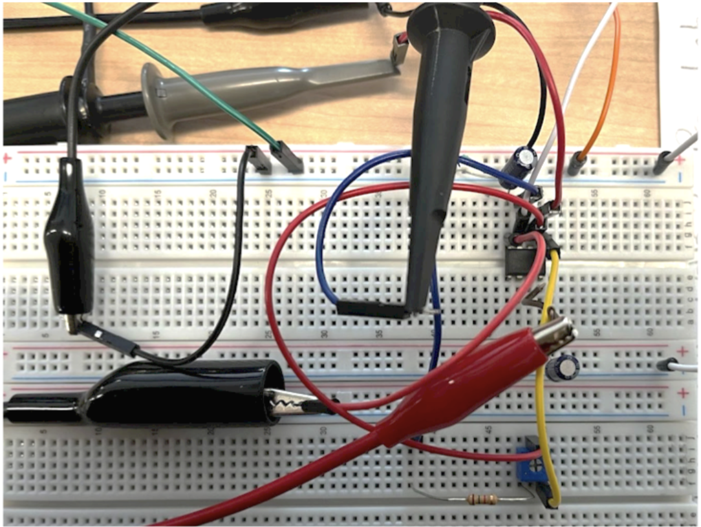

# Lab 1 - Non-Inverting Amplifier

## Objective
1. Construct a circuit with the Non-Inverting Amplifier

2. Compare the **Gain** of the Op-Amp circuit with hand-calculated result, the simulation, and the observed waveform in the oscilloscope.

## The Non-Inverting Amplifier Circuit

Note that the op-amp needs Vcc+ and Vcc- as the power supply.

## Equipment
### Simulation
* Cadence OrCAD for simulation
### Real-World Measurement
* Breadboard
* Circuit Components from the schematics
* Oscilloscope
* Power Supply
* Signal Generator
## Hand-Calculation

| β | Vs (mV) | Vo (mV) | Gain (Vo/Vs)|
|---|--------:|--------:| -----------:|
| 0 | 200 | 200 | 1 |
| 0.5 | 200 | 354 | 1.77 |
| 1 | 200 | 1534 | 7.67 |

## OrCAD Simulation
The same circuit built in OrCAD simulation.

To simulate the two resistor that changes with β, we used a potentiometer.

All values are within 1% difference.
| β | Vs (mV) | Vo (mV) | Gain (Vo/Vs)|
|---|--------:|--------:| -----------:|
| 0 | 199.97 | 199.97 | 1 |
| 0.5 | 199.94 | 353.73 | 1.77 |
| 1 | 199.9 | 1533 | 7.67 |

### β = 0

### β = 0.5

### β = 1

## Real-World Measurement
The same circuit built on a breadboard. The oscilloscope probe connected to the blue wire gets the Vo.

| β | Vs (mV) | Vo (mV) | Gain (Vo/Vs)|
|---|--------:|--------:| -----------:|
| 0 | 213 | 240 | 1.13 |
| 0.5 | 209 | 400 | 1.91 |
| 1 | 209 | 1550 | 7.42 |

### β = 0

### β = 0.5

### β = 1

## Summary
| β | Gain (Hand-Calculated) | Gain (Simulated) | Gain (Measured)| % Difference Simulated and Measured |
|---|--------:|--------:| -----------:|  -----------:|
| 0 | 1 | 1 | 1.13 | 13 |
| 0.5 | 1.77 | 1.77 | 1.91 | 8 |
| 1 | 7.67 | 7.66 | 7.42 | 3 |

We hand-calculated the gains of the op-amp with different potentiometer values from Vo/Vs, where Vs is the 200mV input. In the lab, we simulated and constructed the circuit, collected the Vo, and calculated the gain. Finally, we compared the hand-calculated result, simulation result and measurement result. 

