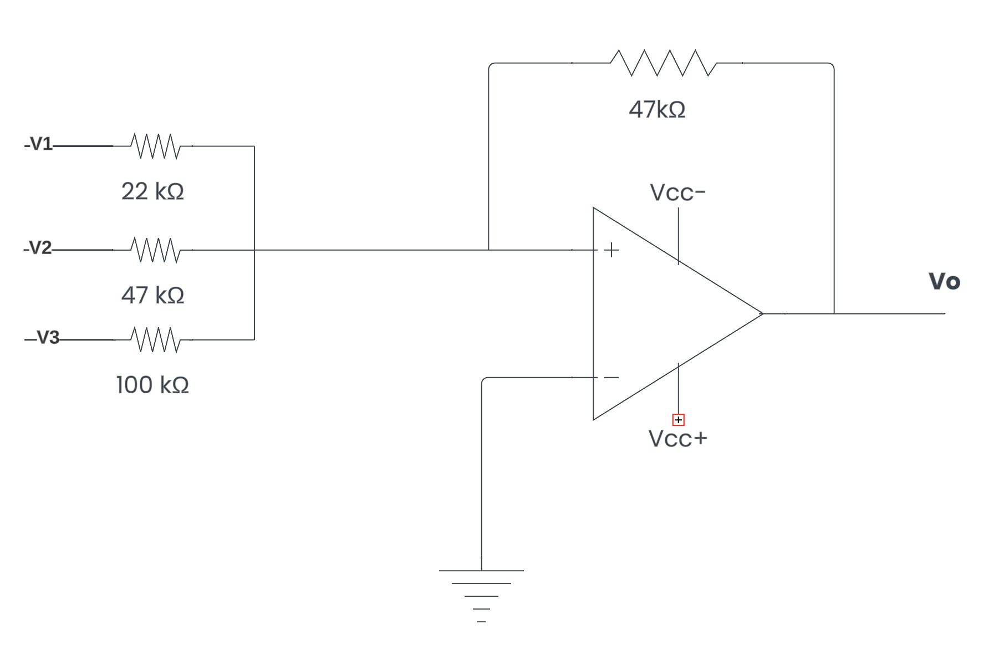
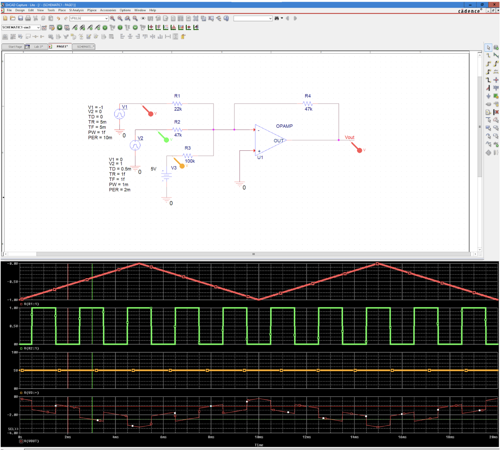
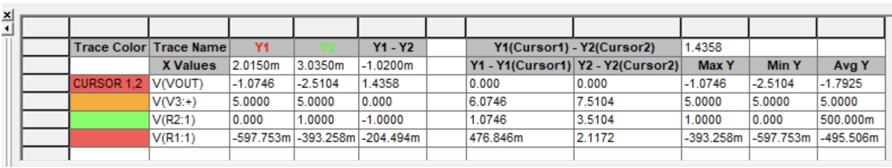
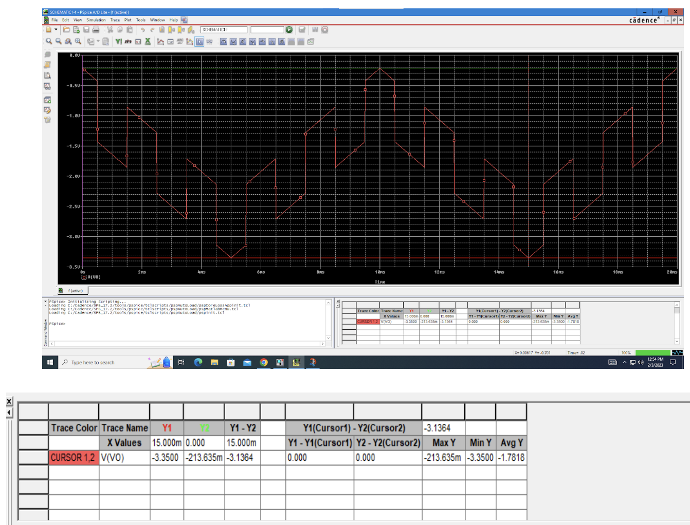
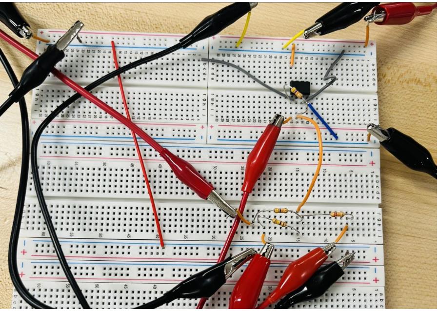

# Lab 2 - Summing Amplifier

## Objective
1. Verify the simulated gain from the summing amplifier through experiment.
2. Verify the simulated waveform from experiment.

## The Summing Amplifier Circuit

## Equipment
### Simulation
* Cadence OrCAD for simulation
### Real-World Measurement
* Breadboard
* Circuit Components from the schematics
* Oscilloscope
* Power Supply
* Signal Generator

## OrCAD Simulation
The three waveforms on the top correspond to V1, V2, and V3. The bottom one is the Vo

### A closer look at Maximum and Minimum Value of Vo

|  | Vo (V) |
|---|--------:|
| Max | -0.213 | 
| Min | -3.35 |

## Real-World Measurement

### Vo

|  | Vo (V) |
|---|--------:|
| Max | -0.200 | 
| Min | -3.46 |

## Summary
The OrCAD simulation is fairly consistent with the real world result.
|  | Simulated Value | Measured Value | % Difference | 
|---|--------:|--------:|--------:|
| Vo Max | -0.213 | -0.2 | 3.2 |
| Vo Min | -3.35 | -3.46 | 6 | 