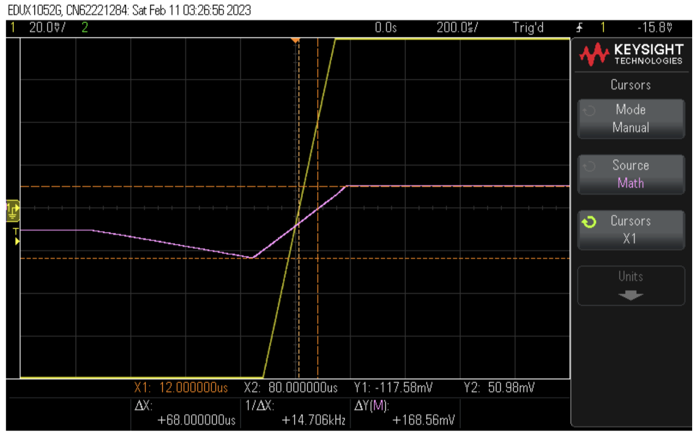

# Lab 3 - RLC Circuit

## Objective
1. Verify the accuracy of theoretical **phasor analysis** on RLC circuit by comparing the result to real-world circuit.
2. Understand **phase difference** and how to find the phase difference from measurement in the **time domain**.

## The RLC Circuit

## Equipment
### Simulation
* Cadence OrCAD for simulation
### Real-World Measurement
* Breadboard
* Circuit Components from the schematics
* Oscilloscope
* Power Supply
* Signal Generator

## Hand Calculation
Transform the RLC circuit into the phasor domain to get the imedance, then combine the impedance of the inductor and resistor in series, capacitor in parallel, and 1 kΩ resistor in series

Given: 

$$
\begin{align*}
R_1 &= 1000\,\Omega \\
R_2 &= 240\,\Omega \\
C &= 0.33 \times 10^{-6}\,F \\
L &= 100 \times 10^{-3}\,H  \\
\end{align*}
$$

The equivalent impedance, $Z_{eq}$, is calculated as:

$$
\begin{align*}
Z_{eq} &= \frac{(\frac{-j}{\omega C})(R_2 + j\omega L)}{R_2 + j\omega L - \frac{-j}{\omega C}} + R_1 \\
&= \frac{R_2 + j\omega L}{1 + j\omega C(R_2 + j\omega L)} + R_1 \\
&= \frac{R_2 + j\omega L + R_1(1 + j\omega C(R_2 + j\omega L))}{1 + j\omega C(R_2 + j\omega L)} \\
&= \frac{R_2 + j\omega L + R_1 + jR_1R_2\omega C - R_1\omega^2 CL}{1 + j\omega C R_2 - \omega^2 LC} \\
&= \frac{(R_1 + R_2 - R_1 \omega^2 LC) + j(\omega L + R_1 R_2 \omega C)}{(1 - \omega^2 LC) + j(\omega CR_2)}
\end{align*}
$$

Simplify the $Z_{eq}$ to:

$$
\begin{equation*}
Z_{eq} = \frac{a + jb}{c + jd}
\end{equation*}
$$

Here

$$
\begin{align*}
a &= R_1 + R_2 - R_1 \omega^2 LC\\
b &= \omega L + R_1 R_2 \omega C \\
c &= 1 - \omega^2 LC \\
d &= \omega CR_2 \\
\end{align*}
$$

To further simplify the complex fraction, multiply the numerator and the denominator by the conjugate of the denominator:

$$
\begin{equation*}
Z_{eq} = \frac{(a + jb)(c - jd)}{(c + jd)(c - jd)} = \frac{ac + bd + j(bc - ad)}{c^2 + d^2}
\end{equation*}
$$

This results in a real part $Re$ and an imaginary part $Im$ of the equivalent impedance:

$$
Z_{eq} = Re + jIm
$$

where

$$
Re = \frac{ac + bd}{c^2 + d^2} 
$$

$$
Im = \frac{bc - ad}{c^2 + d^2} 
$$

| Frequency (Hz) | Angular Frequency (ω) | Z_eq             | Phase (degrees) | Inductive or Capacitive? |
|----------------|-----------------------|------------------|-----------------|--------------------------|
| 100            | 200π                  | 1245.7 + j51.3   | 2.36            | Inductive                |
| 500            | 1000π                 | 1464.6 + j294.5  | 11.4            | Inductive                |
| 1000           | 2000π                 | 1707.3 - j912.7  | -28.1           | Capacitive               |
| 2000           | 4000π                 | 1012.8 - j295.4  | -16.3           | Capacitive               |

## OrCAD Simulation

Correction: the $V_1$ in the image should be $V_s$

| Frequency (Hz) | $V_1$ (V)  | $I_1$ (A)     | Time Difference (Δt) (µs) | Phase Difference (Φ) (Degree) | Re(Zeq) (Ω) | Im(Zeq) (Ω) | Inductive or Capacitive? |
|---------------:|--------:|-----------:|---------------------------:|------------------------------:|------------:|------------:|-------------------------:|
| 100            | 0.802   | 0.00802    | 65.5                       | 2.4                           | 1246.9      | 52.3        | Inductive                |
| 500            | 0.670   | 0.00067    | 63.2                       | 11.4                          | 1492.5      | 301         | Inductive                |
| 1000           | 0.515   | 0.000515   | -77.8                      | -28                           | 1941.7      | -1032       | Capacitive               |
| 2000           | 0.947   | 0.000947   | -22.6                      | -16.3                         | 1056        | -309        | Capacitive               |

Note:
1. $I_1 = \frac{V_1}{Z_eq}$
2. Since $V_s$ has no phase angle, if $Z_eq$ has a positive phase angle, $I_1$ will have a negative phase angle, vice versa.
3. Phase difference is $\phi$. A positive phase difference means that $V_s$ leads $I_1$, and a negative phase difference means $I_1$ leads $V_1$. 
4. $\phi = (\Delta t)(Frequency)(360 \space degrees)$, where $\Delta t$ is the time difference between waveforms, which were calculated by placing two cursors on the Time-intercept of the two waveforms and looking at the Y1 - Y2 time difference.

5. Y1 Cursor Always on Red V1 Waveform, Y2 Cursor Always on Green Vs Waveform

### $f = 100 Hz$

### $f = 500 Hz$

### $f = 1000 Hz$

### $f = 2000 Hz$

## Real-World Measurement

| Frequency (Hz) | Vs (V) |  V1 (V) |    I1 (A) | Time Difference (Δt) (µs) | Phase Difference (Φ) (Degree) | Re(Zeq) (Ω) | Im(Zeq) (Ω) | Inductive or Capacitive? |
|---------------:|-------:|--------:|----------:|---------------------------:|------------------------------:|------------:|------------:|-------------------------:|
|            100 |  0.995 |   0.935 |  0.000935 |                       68.0 |                          2.45 |        1070 |        45.7 |                Inductive |
|            500 |  0.995 |   0.730 |  0.00073  |                       53.0 |                          9.54 |        1370 |         230 |                Inductive |
|           1000 |  0.995 |   0.875 |  0.000875 |                      -76.0 |                        -27.4 |        1143 |       -591  |               Capacitive |
|           2000 |  1.025 |   0.975 |  0.000975 |                      -23.0 |                        -16.6 |        1026 |       -305  |               Capacitive |

Note: 
1. Cursor X2 measures the math waveform
2. Cursor X1 measures the chanel 1 waveform

### $f = 100 Hz$

### $f = 500 Hz$

### $f = 1000 Hz$

### $f = 2000 Hz$

## Summary
In conclusion, the RLC circuit behaves as an inductor at low frequency, and as a capacitor at high frequency.

### OrCAD vs. Measurement
| Frequency | Re(Zeq) Percent Difference (%) | Im(Zeq) Percent Difference (%) |
|----------:|------------------------------:|------------------------------:|
|       100 |                          14.2 |                          12.6 |
|       500 |                           8.2 |                          23.4 |
|      1000 |                          41.1 |                          43.0 |
|      2000 |                             3 |                           1.3 |

The resulting waveform changes when we switch the inductors around or even twist it on the circuit board slightly. Therefore, the percent difference between our results are highly inconsistent. 

Nevertheless, the experiment result generally follows the trend of the simulation and pre-lab calculation. At low frequency f < 1000, the capacitor acts as an open circuit and the total impedance is dominated by the inductor, so we get an inductive circuit. 
At high frequency f > 1000,  the inductor acts as an open circuit and the total impedance is dominated by the capacitor, so we get a capacitive circuit.
