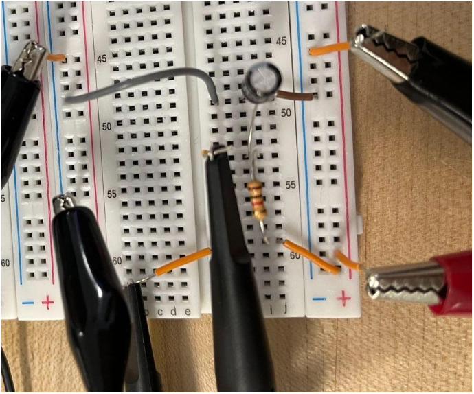
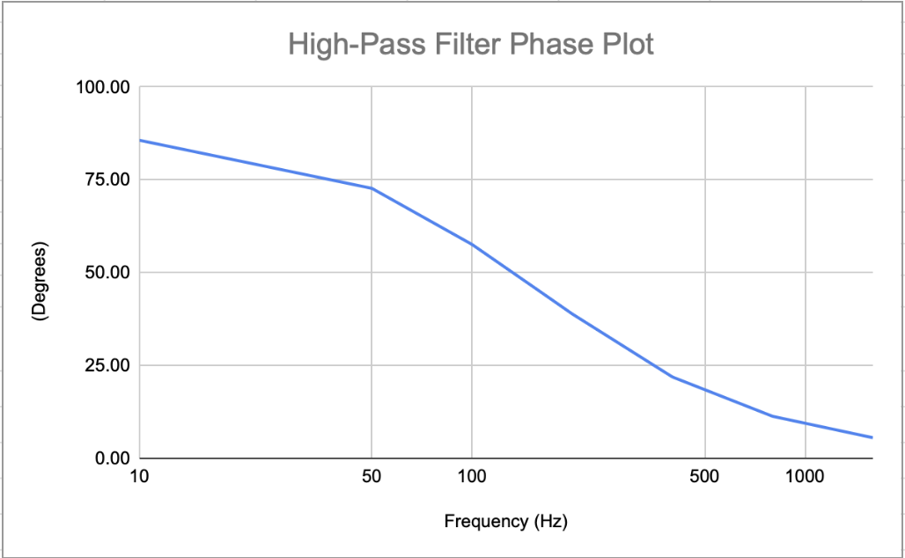
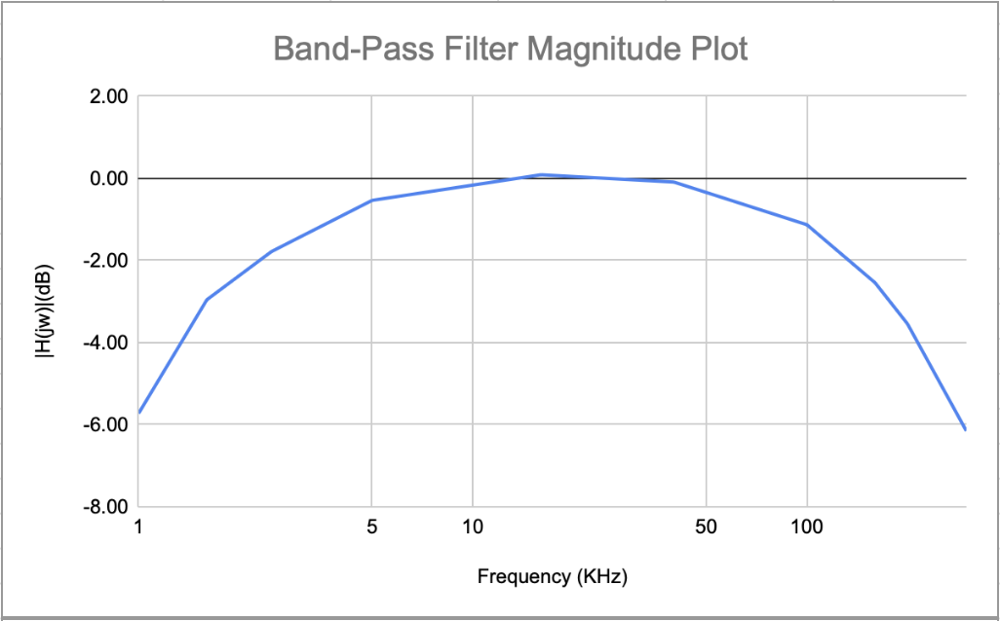
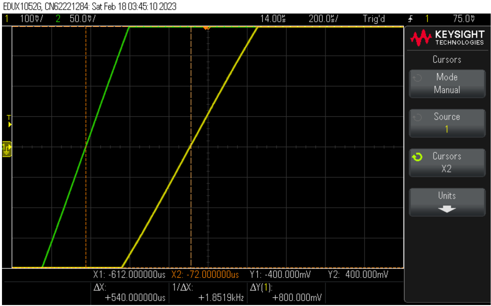
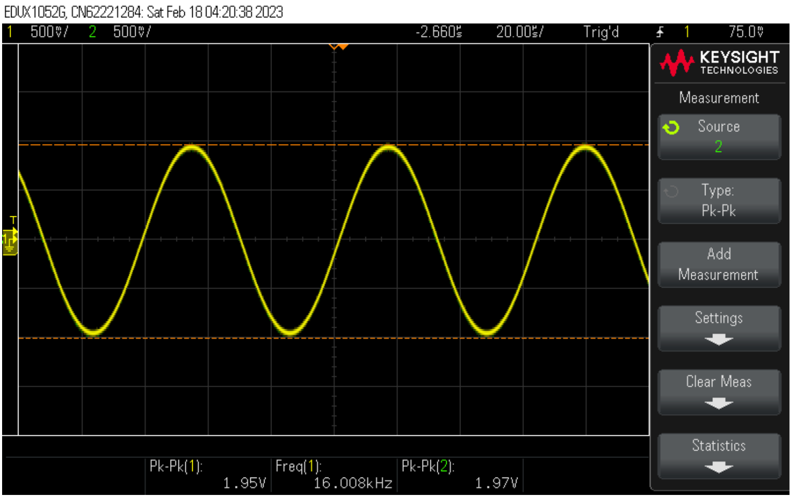

# Lab 4 - Passive Filter

## Objective
1. Construct passive low-pass, high-pass, and band-pass filters with resistor, capacitor, and inductor.
2. Find the gain, phase, cut-off frequency and the central frequency of the filters.
3. Observe the difference between the OrCAD-simulated bode diagram and the plot generated by actual experimental data.
2. Observe the changes in the output waveforms on the oscilloscope as we change the frequency. 

## Passive Filters
### Low-Pass Filter

### High-Pass Filter

### Band-Pass Filter

## Equipment
### Simulation
* Cadence OrCAD for simulation
### Real-World Measurement
* Breadboard
* Circuit Components from the schematics
* Oscilloscope
* Power Supply
* Signal Generator

## OrCAD Simulation

### High and Low-Pass Filter

|                | \|H(jω)\| | φ (Degrees) |
|----------------|----------------------:|-------------------------:|
| Low-Pass Filter|                 0.708 |                    -45.1 |
| High-Pass Filter|                0.708 |                     44.99 |

### Band-Pass Filter

| Frequency | \|H(jω)\| | φ (Degrees) |
|----------------------|----------------------:|-------------------------:|
| $\omega_0$           |                     1 |                        0 |
| $\omega_{c1}$        |        $\frac{1}{\sqrt{2}} ≈ 0.707$ |                       45 |
| $\omega_{c2}$        |       $\frac{1}{\sqrt{2}} ≈ 0.707$ |                      -45 |

### Low-Pass Filter Bode Plot

### High-Pass Filter Bode Plot

### Band-Pass Filter Bode Plot

## Real-World Measurement
* Ain = peak to peak value of the input voltage Aout = peak to peak value of the output voltage
* $|H(j\omega)|$ = $\frac{A_{out}}{A_{in}}$
* $|H(j\omega)|(dB) =20log(|H(j\omega)|)$
* td = Channel 1 (Ain) Time - Channel 2 (Aout) Time 
* Degrees = td * Frequency (Hz) * 360 (Degrees)
### Low-Pass Filter

| Frequency (Hz) | Aout (Vpp) | Ain (Vpp) | \|H(jω)\| | \|H(jω)\| (dB) | td(s)      | φ (Degrees) |
|----------------|-----------:|----------:|------:|-----------:|------------:|------------:|
| 10             |       2.05 |      2.07 | 0.990 |      -0.08 | -1.08E-03   |       -3.89 |
| 50             |       1.95 |      2.03 | 0.961 |      -0.35 | -9.98E-04   |      -17.96 |
| 100            |       1.67 |      1.99 | 0.839 |      -1.52 | -9.00E-04   |      -32.40 |
| 160            |       1.38 |      1.95 | 0.708 |      -3.00 | -7.80E-04   |      -44.93 |
| 200            |       1.20 |      1.95 | 0.615 |      -4.22 | -7.12E-04   |      -51.26 |
| 400            |       0.70 |      1.91 | 0.366 |      -8.72 | -4.60E-04   |      -66.24 |
| 800            |       0.40 |      1.87 | 0.214 |     -13.40 | -2.60E-04   |      -74.88 |
| 1600           |       0.18 |      1.87 | 0.098 |     -20.19 | -1.33E-04   |      -76.61 |

### High-Pass Filter

| Frequency (Hz) | Aout (Vpp) | Ain (Vpp) | \|H(jω)\| | \|H(jω)\| (dB) | td(s)      | φ (Degrees) |
|----------------|-----------:|----------:|-------:|------------:|-----------:|------------:|
| 10             | 0.127      | 2.05      | 0.062  | -24.16      | 2.38E-02   | 85.68       |
| 50             | 0.599      | 2.03      | 0.295  | -10.60      | 4.04E-03   | 72.72       |
| 100            | 1.05       | 1.99      | 0.528  | -5.55       | 1.60E-03   | 57.60       |
| 160            | 1.37       | 1.95      | 0.703  | -3.07       | 7.80E-04   | 44.93       |
| 200            | 1.51       | 1.95      | 0.774  | -2.22       | 5.40E-04   | 38.88       |
| 400            | 1.73       | 1.89      | 0.915  | -0.77       | 1.52E-04   | 21.89       |
| 800            | 1.83       | 1.87      | 0.979  | -0.19       | 3.92E-05   | 11.29       |
| 1600           | 1.87       | 1.87      | 1.000  | 0.00        | 9.60E-06   | 5.53        |

### Band-Pass Filter

| Frequency (KHz) | Aout (Vpp) | Ain (Vpp) | \|H(jω)\| | \|H(jω)\| (dB) | td(s)    | φ (Degrees) |
|-----------------|-----------:|----------:|----------:|------------:|---------:|------------:|
| 1               |       1.05 |      2.03 |     0.517 |       -5.73 | 1.58E-04 |       56.88 |
| 1.6             |       1.43 |      2.01 |     0.711 |       -2.96 | 7.60E-05 |       43.78 |
| 2.5             |       1.67 |      2.05 |     0.815 |       -1.78 | 3.70E-05 |       33.30 |
| 5               |       1.89 |      2.01 |     0.940 |       -0.53 | 9.20E-06 |       16.56 |
| 16              |       1.97 |      1.95 |     1.010 |        0.09 | 0.00E+00 |        0.00 |
| 40              |       1.93 |      1.95 |     0.990 |       -0.09 | 8.20E-07 |      -11.81 |
| 100             |       1.73 |      1.97 |     0.878 |       -1.13 | 9.20E-07 |      -33.12 |
| 160             |       1.47 |      1.97 |     0.746 |       -2.54 | 8.30E-07 |      -47.81 |
| 200             |       1.31 |      1.97 |     0.665 |       -3.54 | 7.90E-07 |      -56.88 |
| 300             |       0.98 |      1.99 |     0.492 |       -6.15 | 6.70E-07 |      -72.36 |

### Low-Pass Filter at 200 Hz

### High-Pass Filter at 200 Hz

### Band-Pass Filter at 16 kHz

## Summary

$\%difference = \frac{|Experimental \space Data - Simulation \space Data|}{Experimental \space Data}$

|                | \|H(jω)\| simulated | φ (Degrees) simulated | \|H(jω)\| measured | φ (Degrees) measured | \|H(jω)\| Difference (%) | φ Difference (%) |
|----------------|------------------:|----------------------:|------------------:|---------------------:|----------------------:|------------------:|
| Low-Pass Filter|              0.708|                  -45.1|              0.708|                -44.93|                   0.14|               0.22|
| High-Pass Filter|             0.708|                   44.99|             0.703|                 44.99|                   0.14|               0.02|
| $\omega_0$  |                  1|                      0|              1.01|                     0|                      1|                  0|
| $\omega_{c1}$ |          0.707|                    45|              0.711|                 43.8|                   0.57|               2.67|
| $\omega_{c2}$ |          0.707|                   -45|              0.746|                -47.8|                    5.5|               6.22|
