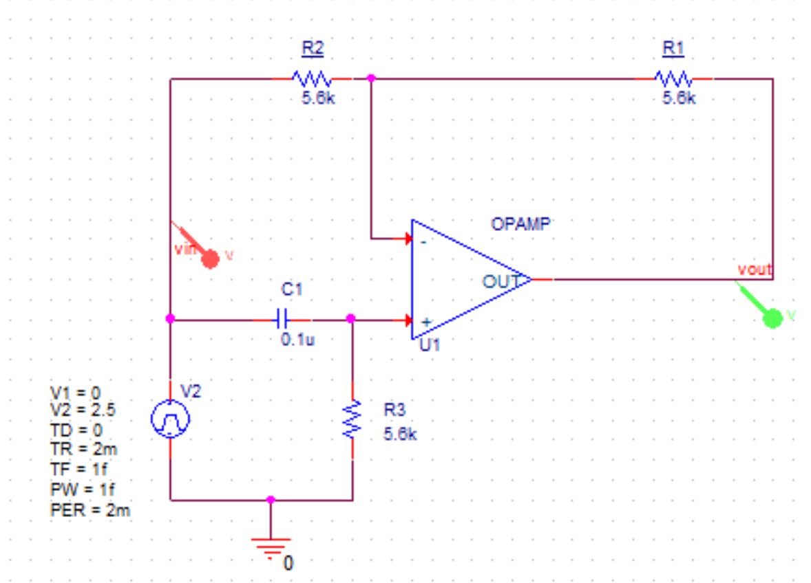
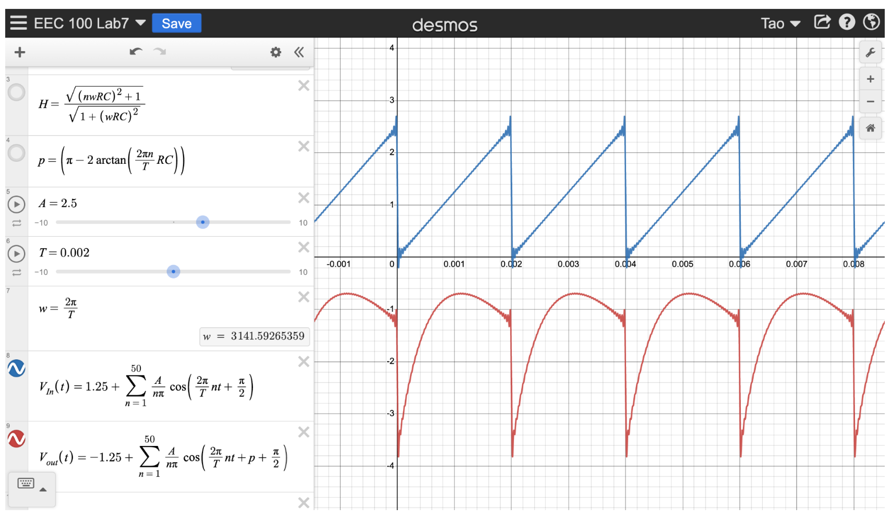
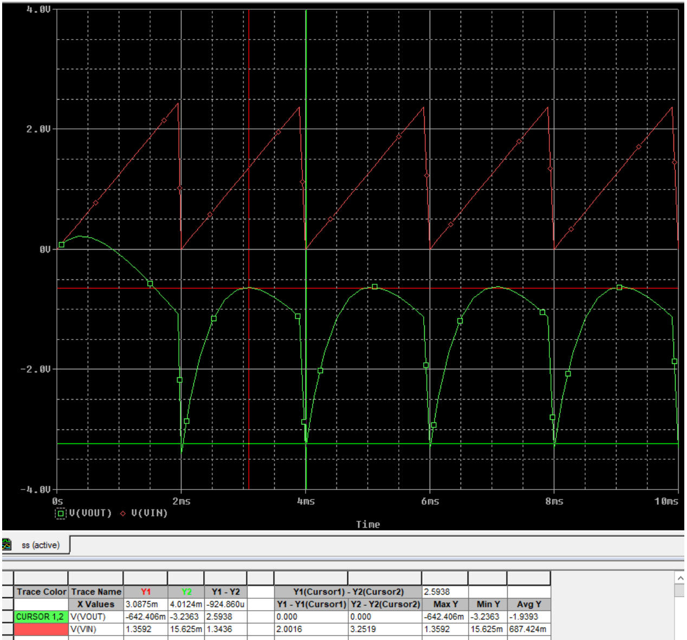
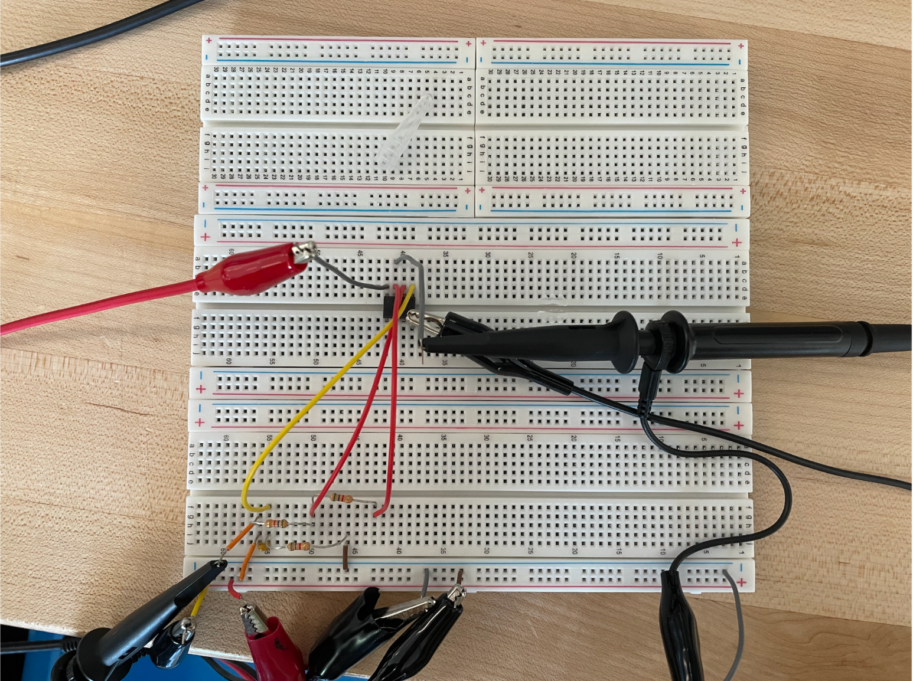
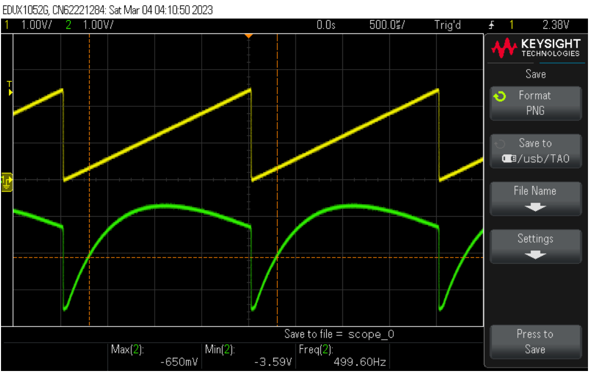

# Lab 5 - Fourier Series

## Objective
1. Understanding how transfer function acts on the frequency domain of the fourier series component
2. Verify through experiment that we could treat the circuit as a linear system and apply the transfer function to individual fourier harmonics and sum them to get the response.

## The Circuit

## Equipment
### Simulation
* Cadence OrCAD
### Real-World Measurement
* Breadboard
* Circuit Components from the schematics
* Oscilloscope
* Power Supply
* Signal Generator

## Hand-Calculation
Please ignore the n in transfer function magnitude, H. H will always be 1 for this circuit.

To hand-calculate the output of this circuit with a sawtooth input wave, we broke the input wave into a fourier series sum, then multiplied the sum by the magnitude of the transfer function and added the transfer function's phase.

### $F = 500 Hz$

## Simulation
### $F = 500 Hz$

## Real-World Measurement

### $F = 500 Hz$
The green wave is the Vout

| Vout  |  | Min (V) |
|-:|--------:|--------:|
| Simulation | -0.642 | -3.24 |
| Experiment |  | -3.59 |

| Vout  | Simulation | Experiment | Percent Difference (%) |
|------:|-----------:|-----------:|-------------------:|
| Max (V) | -0.642 | -0.650 | 1.23 |
| Min (V) | -3.24 | -3.59 | 9.75 |

## Summary 

Fourier Series is a useful tool for us to analyze the output of periodic non-sinusoidal waves because 
we could decompose them into sinusoidal waves then apply the transfer function.
