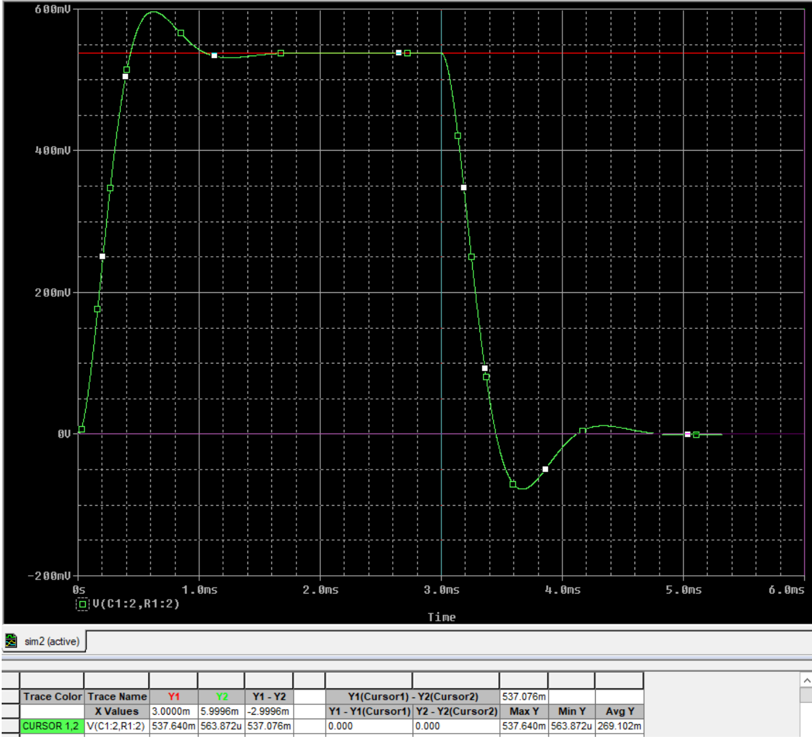

# Lab 6 - Laplace Transform Technique

## Objective
1. Verify that theoretical methods such as the Laplace Transform is able to derive the
transient and steady state responses of time-dependent circuits.

## The Circuit

## Equipment
### Simulation
* Cadence OrCAD
### Real-World Measurement
* Breadboard
* Circuit Components from the schematics
* Oscilloscope
* Power Supply
* Signal Generator

## Hand-Calculation

$V_{out} = f(x)$

| $V_{out}(t)$                         | Value    |
|--------------------------------------|---------:|
| Steady State Voltage before Switch Opened                   | 0.538 V  |
| Steady State Voltage after the Switch Opened                    | 0 V      |
| Transient State Minima                   | -0.078 V |
| Time to Reach the Minima | 0.67 ms  |

## Simulation
Instead of adding a switch in the simulation, we modeled the input voltage as a step function that supplies voltage until 3 ms. Note that the circuit has reached steady-state before 3 ms.

Therefore, treat 3ms as the t = 0 in simulation.

| $V_{out}(t)$                                  | Pre-Lab Calculation | Simulation |
|-----------------------------------------------|-------------------:|-----------:|
| Steady State Voltage before Switch Opened    | 0.538 V            | 0.538 V    |
| Steady State Voltage after the Switch Opened  | 0 V                | 563 uV     |
| Transient State Minima                        | -0.078 V           | -0.0776 V  |
| Time to Reach Minima after the Switch Opened  | 0.67 ms            | 0.67 ms    |

### Voltage before (Red) and After (Green) Switch Opened

### Transient State Minima and Time (Red)

## Real-World Measurement

| $V_{out}(t)$                                  | Pre-Lab Calculation | Simulation | Experiment |
|-----------------------------------------------|-------------------:|-----------:|-----------:|
| Steady State Voltage before Switch Opened    | 0.538 V            | 0.538 V    | 0.533 V |
| Steady State Voltage after the Switch Opened  | 0 V                | 563 uV     | 4.68 mV |
| Transient State Minima                        | -0.078 V           | -0.0776 V  | -0.0803 V |
| Time to Reach Minima after the Switch Opened  | 0.67 ms            | 0.67 ms    | 0.6 ms |

### Steady State Voltage before Switch Opened

### Steady State Voltage after the Switch Opened

### Time to Reach the Minima and Minima

## Summary

| $V_{out}(t)$                                  | Simulation | Experiment | Percent Difference Between Simulation and Experiment |
|-----------------------------------------------|-----------:|-----------:| --: |
| Steady State Voltage before Switch Opened     | 0.538 V    | 0.533 V | 0.93 |
| Steady State Voltage after the Switch Opened  |  563 uV     | 4.68 mV | Error |
| Transient State Minima                        |  -0.0776 V  | -0.0803 V | 3.48 |
| Time to Reach Minima after the Switch Opened  |  0.67 ms    | 0.6 ms | 10 |

In this lab, we found the transient state and steady state of a circuit with active elements- capacitor and inductor. The output voltage drops quickly after the switch closes and reaches the minimum value within 0.6ms. Then the voltage increases to the steady state which is almost 0v. That is because there is energy stored in the capacitor and inductor before the switch closes. We simulated the circuit with Orcad, and tested V_{out}(t). Similarly to the trend in the prelab, voltage decreased to the minimum after the switch closed and then reached the steady state. We also constructed the circuit and measured the V_{out}(t). We had some problems connecting the switch and got help from the TA. Moreover, the measured result was in the wrong trend at first, with the help of TA, we found that we didn’t measure the exact resistance of the inductor and solved this by adding a resistor to modify the resistance. The percent differences between the measured results and simulated results may be caused by the capacitor or inductor, because we tried three different capacitors and inductors and got slightly different results.
However, We don't understand why the percent error for steady state voltage after the switch opened is that high, thus we left it as error to indicate there's a problem with the data.